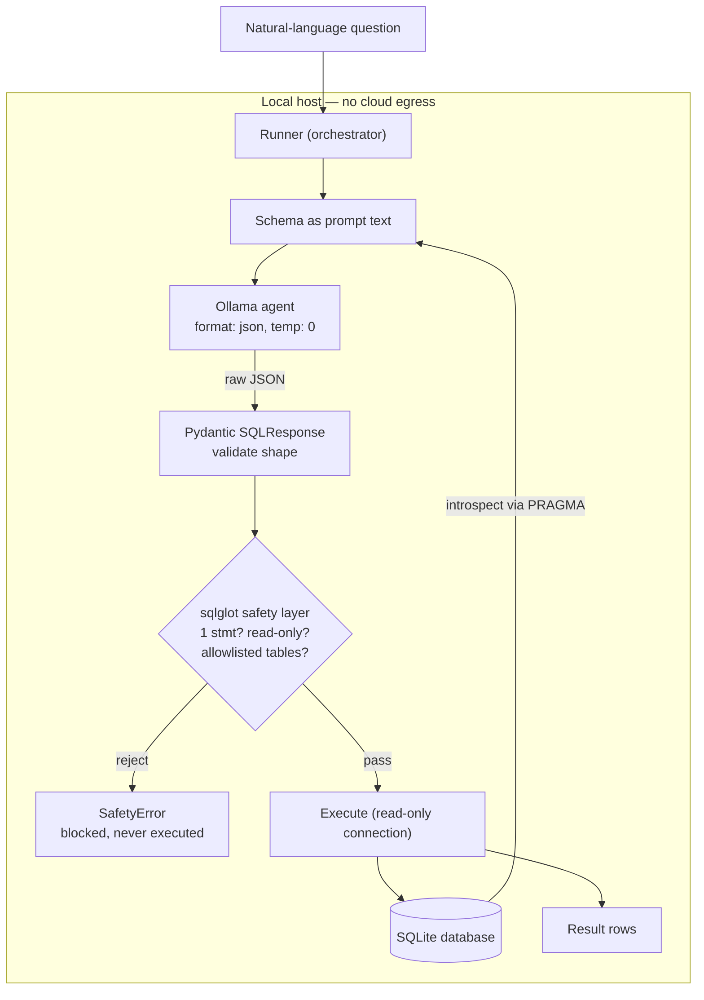

# Secure Local DB Agent

[](https://github.com/ragulnarayanan/secure-local-db-agent/actions/workflows/tests.yml)

> Offline text-to-SQL agent with structured output and an AST-based SQL safety layer. Built for environments where data cannot leave the host.


A natural-language question goes in; a validated, read-only SQL query runs against a local SQLite database and returns results — using a local LLM via Ollama, with **zero cloud egress**. Every generated query is parsed and checked against an allowlist *before* it touches the database.

## Results

Benchmarked on 20 questions against the Chinook schema (M4 Pro, 24 GB unified memory), `temperature = 0`, with result-equivalence checking:

| Model | Accuracy | easy | medium | hard | p50 latency | p95 latency |
|-------|----------|------|--------|------|-------------|-------------|
| llama3.1:8b      | **85%** | 5/5 | 8/10 | 4/5 | 1580 ms | 2748 ms |
| qwen2.5-coder:7b | 75%     | 4/5 | 7/10 | 4/5 | 1566 ms | 2580 ms |
| phi3:mini (3.8B) | 70%     | 5/5 | 7/10 | 2/5 | 994 ms  | 1797 ms |

A code-specialized model (qwen) did not beat a general one (llama); the 3.8B model traded hard-query accuracy for ~37% lower latency. See [`docs/results.md`](docs/results.md) for the full failure-mode analysis — including two model errors the safety layer caught (a hallucinated table name and T-SQL syntax).

## Architecture



Details and design rationale in [`docs/architecture.md`](docs/architecture.md).

## Why this exists

- **Zero data egress** — schema and data never leave the host; the only model call is to a local Ollama server.
- **Structured output** — Ollama's `format: "json"` constrains generation to valid JSON; Pydantic validates the *shape*. No markdown stripping, no regex parsing.
- **AST-based safety layer** — every query is parsed with `sqlglot` and rejected unless it's a single read-only SELECT against allowlisted tables. The allowlist check is recursive (no hiding tables in subqueries) and CTE-aware.
- **Benchmarked, not claimed** — accuracy and latency measured across three models with result-equivalence checking.

## Stack

Python 3.11 · Ollama · `sqlglot` · `pydantic` · `pandas` · `streamlit` · `pytest`
Local models: `qwen2.5-coder:7b`, `llama3.1:8b`, `phi3:mini`

## Run it

```bash
# 1. Prereqs: Ollama + at least one model
brew install ollama
ollama serve                       # in a separate terminal
ollama pull llama3.1:8b

# 2. Project
git clone https://github.com/ragulnarayanan/secure-local-db-agent.git
cd secure-local-db-agent
python3.11 -m venv .venv && source .venv/bin/activate
pip install -e ".[dev]"

# 3. Try it (the Chinook sample DB is included)
python -m src.schema data/chinook.db   # inspect schema introspection
streamlit run ui/app.py                # the UI
python -m evals.run_eval               # benchmark models

# Tests
pytest -q
```

## Project layout

```
src/        schema introspection, Ollama agent, safety layer, runner
tests/      mirrors src/ (unit tests; Ollama-dependent tests auto-skip)
evals/      curated question set + result-equivalence eval harness
ui/         Streamlit app
docs/       architecture + results writeup
data/        Chinook sample database
```

## License

[MIT](LICENSE)
