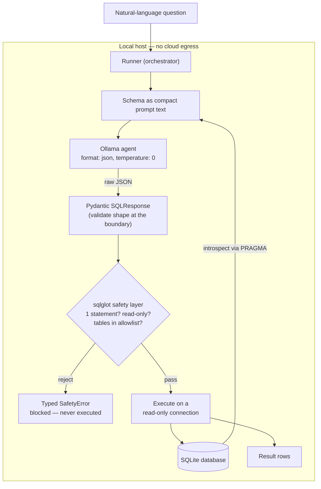

# Architecture

Every stage runs on the host. The database schema and contents never leave the
machine — the only "model call" is to a local Ollama server.

## Components

| Module | Responsibility | Key choice |
|--------|----------------|------------|
| `src/schema.py` | Introspect any SQLite DB into a prompt-ready string | `PRAGMA` over parsing DDL; dataclasses (data we own) |
| `src/agent.py`  | Call the local model, return validated SQL | `format: "json"` grammar constraint; Pydantic on untrusted output |
| `src/safety.py` | Reject anything but a read-only SELECT on allowed tables | AST parsing, not regex; typed exceptions |
| `src/runner.py` | Orchestrate the pipeline; execute read-only | Defense in depth (parser **and** read-only connection) |
| `evals/`        | Benchmark models by result-equivalence | Compare result sets, not SQL text |
| `ui/app.py`     | Streamlit demo that surfaces the safety verdict | Cached Runner per model |

## Design decisions worth calling out

- **Dataclasses vs. Pydantic, in the same project.** The schema comes from
  SQLite's own catalog (trusted) — plain dataclasses. The model's JSON is
  untrusted — Pydantic validates it at the boundary. The choice follows the data,
  not a blanket rule.
- **`format: "json"` ≠ trusting the output.** The grammar constraint guarantees
  *parseable* JSON; Pydantic guarantees it's the *right shape*. Two different
  guarantees, stacked.
- **AST-based safety, not regex.** `SELECT * FROM t WHERE name = 'DROP TABLE x'`
  is a harmless SELECT — the parser sees a string literal where regex sees a
  threat. The allowlist check is recursive, so a forbidden table can't hide in a
  subquery, and CTE names are excluded so valid `WITH` queries aren't rejected.
- **Defense in depth.** The safety layer enforces SELECT-only at the SQL layer;
  the connection is opened read-only at the driver layer. Independent controls.
- **Result-equivalence evaluation.** Two correct queries rarely match as text, so
  the eval compares result sets as multisets of rows (row/column-order
  independent, float-tolerant).
